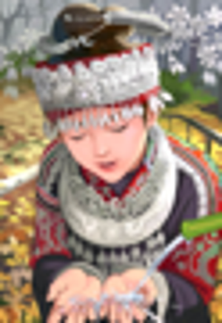
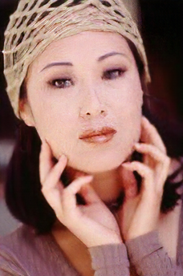
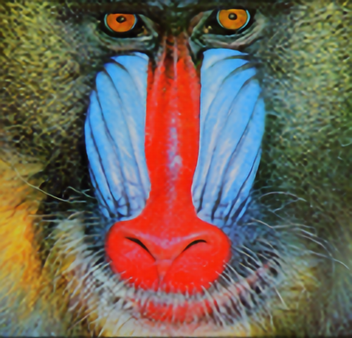

#  Photo-Realistic Single Image Super-Resolution Using a Generative Adversarial Network

## Overview

An unofficial implementation of SRGAN described in the paper using PyTorch.
* [ Photo-Realistic Single Image Super-Resolution Using a Generative Adversarial Network](https://arxiv.org/abs/1609.04802)

Published in CVPR 2017

## Requirement
- Python 3.6.5
- PyTorch 1.1.0 
- Pillow 5.1.0
- numpy 1.14.5
- scikit-image 0.15.0

## Datasets
- [DIV2K](https://data.vision.ee.ethz.ch/cvl/DIV2K/)

## Pre-trained model
- [SRResNet](https://drive.google.com/open?id=15F2zOrOg2hIjdI0WsrOwF1y8REOkmmm0)


- [SRGAN](https://drive.google.com/open?id=1-HmcV5X94u411HRa-KEMcGhAO1OXAjAc)

## Train & Test
Train 

```
python main.py --LR_path ./LR_imgs_dir --GT_path ./GT_imgs_dir
```

Test

```
python main.py --mode test --LR_path ./LR_imgs_dir --GT_path ./GT_imgs_dir --generator_path ./model/SRGAN.pt
```

Inference your own images

```
python main.py --mode test_only --LR_path ./LR_imgs_dir --generator_path ./model/SRGAN.pt
```

## Experimental Results
Experimental results on benchmarks.

### Quantitative Results

| Method| Set5| Set14| B100 |
|-------|-----|------|------|
|Bicubic|28.43|25.99|25.94|
|SRResNet(paper)|32.05|28.49|27.58|
|SRResNet(my model)|31.96|28.48|27.49|
|SRGAN(paper)|29.40|26.02|25.16| 
|SRGAN(my model)|29.93|26.95|26.10| 

### Qualitative Results

| Bicubic | SRResNet | SRGAN |
| --- | --- | --- |
|  | |  |
|  | |  |
|  | |  |

## Comments
If you have any questions or comments on my codes, please email to me. [son1113@snu.ac.kr](mailto:son1113@snu.ac.kr)

